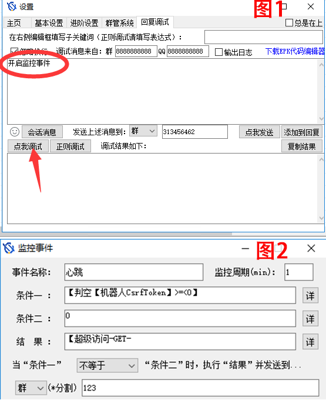

## 鱼子酱心跳系统

**欢迎使用鱼子酱的心跳系统**

#### 这套系统有什么功能

* 心跳机制是定时发送一个自定义的结构体(心跳包)，让对方知道自己还活着，以确保连接的有效性的机制。
* 当接入该心跳系统时，会有专门的机器人对上线和离线的客户端进行播报，达到及时发现bot意外离线的目的。

#### 你需要了解的信息
* 你需要明确知晓，心跳上报相关的消息由用户插件本体主动进行上报，仅心跳相关扩展服务而言，服务器不会发出影响到机器人运行的消息，或控制机器人的运行。
* 你需要明确知晓，接入本处所提供的服务器后，你将会出现在一系列的HttpApi之中，例如鱼子酱心跳API之中，这是立即自动完成的，鱼仙不会对因你的相关信息公开而对你造成的任何损失负责，如有隐私方面的顾虑，请在此止步。
* 你需要明晰本处所收集的相关信息，并且明白相关信息被上报之后的意义。

#### API

**GET** `http://api.fishroud.xyz/heartbeat/`

#### 请求

| 字段名 | 必须 | 说明 |
| :----:| :----:|:----:|
| `qq` | true| 上报心跳机器人的qq号 |
| `token` | false| 上报心跳机器人的token，带上token访问上报心跳，若不带token则返回该bot在线状态 |

#### 你需要这样接入
* 访问网站[青果DICETOKEN获取](http://benzencloudhk.xyz/index.php/dicetoken/)，挑一个喜欢的token并牢记
* 当你选定了一个Token之后，你需要将它记录下来，将`Token`与你的所需要接入的`bot的QQ号`,`bot的昵称`,`你的qq号`,`你自己的称呼`上报给鱼仙
* 得到鱼仙肯定的答复后，使用`铃心自定义`或其他方法访问上报接口

#### 特别篇：如何使用铃心自定义进行上报
1.开启监控事件
- 打开铃心自定义，选择`回复调试`
- 在框内输入`开启监控事件`，点击`点我调试`

2.填入监控事件相关条件

| 输入框 | 填入值 | 说明 |
| :----:| :----:|:----:|
| `事件名称` | | 可自定义该事件名称 |
| `监控周期（min）` | `1` | bot进行上报的频率 |
| `条件1` | `【判空【机器人CsrfToken】>=<0】` | 取机器人的`CsrfToken`，若失败则返回0 |
| `条件2` | `0` | - |
| `结果` | `【超级访问-GET-UTFhttp://api.fishroud.xyz/heartbeat/?qq=【机器人QQ】&token=[你上报给鱼仙的token]】` | 对接口进行上报 |
- 正确示例：`【超级访问-GET-UTFhttp://api.fishroud.xyz/heartbeat/?qq=123456&token=abcdef】`

3.完善剩余信息
- 请选择当“条件1”`不等于`“条件2”时，将结果发送到一个**不存在**的群号（如123）
- 最后请记得保存
  

4.当群内出现上线提示，则为上报成功