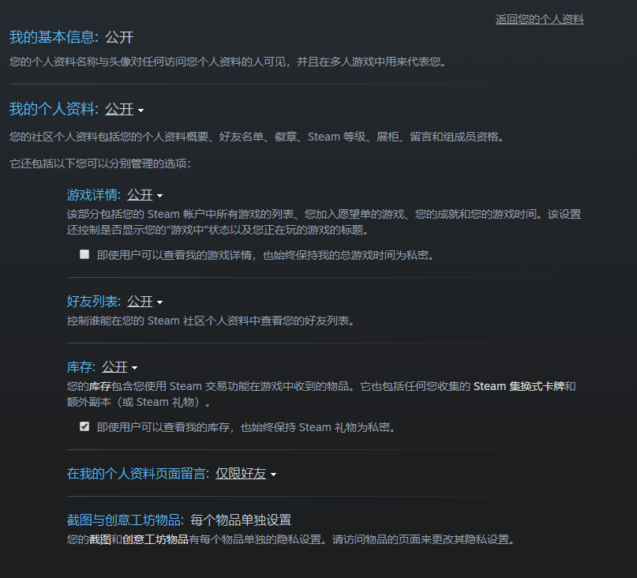

## steam游戏监控
***
#### 鱼子酱可以偷偷看你们都玩过什么游戏哦

详情请参阅[Steamworks Web API 参考资料](https://partner.steamgames.com/doc/webapi)

#### 注意事项
* 本功能用的是鱼仙自己的steamApiKey进行爬取，未添加鱼仙steam好友或设置了隐私选项的用户可能会返回空白结果



* 点击steam客户端右上角个人昵称，选择**账户明细**选项，即可看到自己的steam ID（64位）


### 向鱼子酱绑定steam账户

***


**指令:** `steambind[自定义昵称]=[steam64位ID]`

**注意：**

* 一个QQ对应一个昵称和一个账号，无法帮助他人绑定
* 如果需要修改自定义昵称请重新绑定

**正确示例：**  
指令： `steambind鱼仙=76561198797703039`

返回:
```
[steam头像]
绑定成功!鱼仙->Fishroud
```
  
 
  
### 绑定后可使用的指令

***

**指令:** `*[自定义昵称]在玩啥`

返回该昵称下对应steam用户最近两周游玩游戏的其中一款

**正确示例：**  
指令： `*鱼仙在玩啥`

返回:
```
#让鱼子酱看看

SteamName：Fishroud
鱼仙两周内共游玩30款游戏
最近在玩：
Tom Clancy's Rainbow Six Siege
游戏时长：24.57/124.62h
[图片]
```
***
**指令:** `*现在[自定义昵称]在玩啥`

返回该昵称下对应steam用户当前是否正在游玩游戏

**正确示例：**  
指令： `*现在鱼仙在玩啥`

若昵称下账号未在游玩游戏:
```
#让鱼子酱偷瞄一下...

#鱼仙当前并没有玩任何游戏哦
```

若昵称下账号正在游玩游戏:
```
#让鱼子酱偷瞄一下...

鱼仙当前正在游玩
LiEat
[图片]
#要加入吗
```

***
**指令:** `*[自定义昵称]最近游玩`

返回该昵称下对应steam用户最近两周游玩的所有游戏

**注意：**

由于部分用户游玩游戏较多，导致消息过长，极易被腾讯屏蔽

**正确示例：**  
指令： `*404最近游玩`

返回:
```
#让鱼子酱数数

404两周内共玩了6款游戏！
1.tModLoader
[图片]
2.Dying Light
[图片]
3.Stellaris
[图片]
4.Wallpaper Engine
[图片]
5.War Thunder
[图片]
6.World of Tanks Blitz
[图片]
```

### 无需绑定就能使用的功能

***

**指令:**
* `https://steamcommunity.com/profiles/[steam64位ID]/`
* `/steam[steam64位ID]`

直接发送个人资料页面的url或者使用/steam后接64位id

**正确示例：**  
指令：
* `https://steamcommunity.com/profiles/76561198797703039/`
* `/steam76561198797703039`

返回:
```
#鱼子酱好像发现了社区url！

SteamName：Fishroud
两周内游玩30款游戏
最近在玩：
Portal
总游戏时长：3.22h
```


### steam游戏监控及自动播报（未开放）

**鱼子酱会对特定用户进行游戏监听，当用户开始进行游戏时会自动在特定群进行广播**
```
Fishroud开始游玩：
War Thunder
[图片]
```


